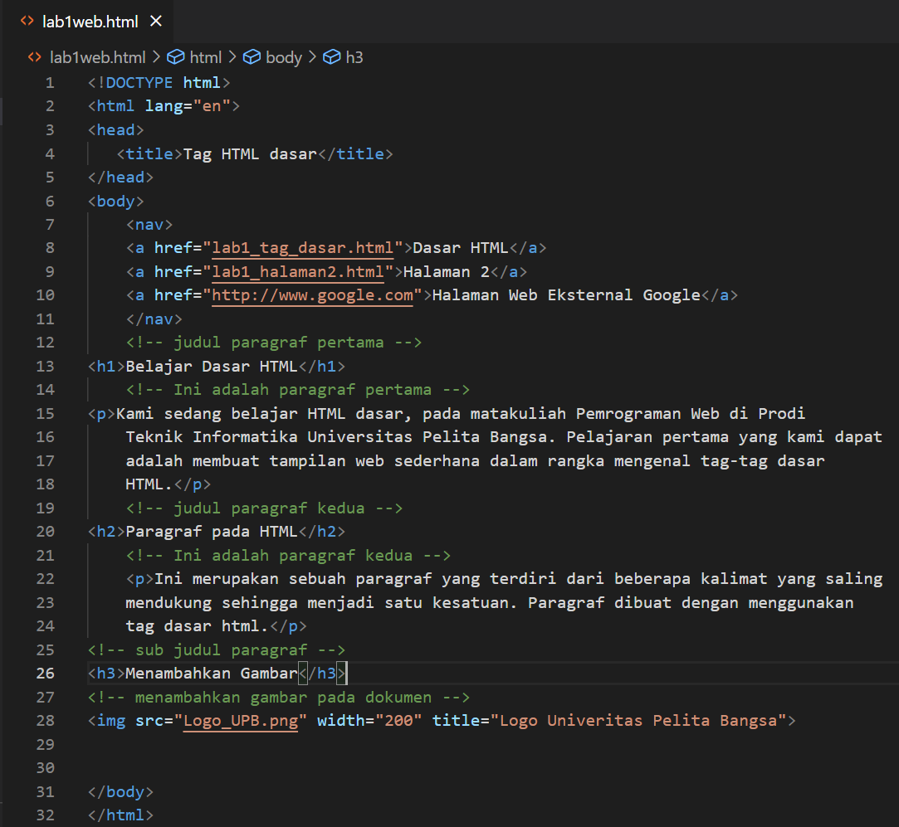
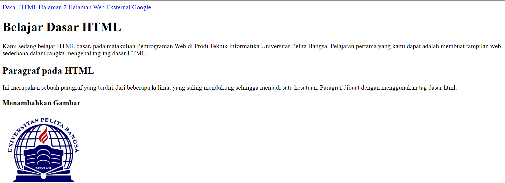

# Lab1Web

Nama : Michael valentino laisina

NIM : 312110045

Kelas : TI.21.B2

Berikut script nya :

hasil dari script diatas :

Jawab Pertanyaan Berikut

1. Lakukan perubahan pada kode sesuai dengan keinginan anda, amati perubahannya adakah
error ketika terjadi kesalahan penulisan tag?
2. Apa perbedaan dari tag 
 dengan tag  , berikan penjelasannya!
3. Apa perbedaan atribut title dan alt pada tag , berikan penjelasannya!
4. Untuk mengatur ukuran gambar, digunakan atribut width dan height. Agar tampilan gambar
proporsional sebaiknya kedua atribut tersebut diisi semua atau tidak? Berikan penjelasannya!
5. Pada link tambahkan atribut target dengan nilai atribut bervariasi ( _blank, _self, _top,
_parent ), apa yang terjadi pada masing-masing nilai antribut tersebut?

jawab:

1. Ya terjadi kesalahan
2. Jadi perbedaan yang mencolok dari kedua tag ini adalah pada jarak yang terbentuk.
Kesimpulannya jika hanya ingin membuat baris baru tanpa jarak gunakan tag   , tapi jika sobat ingin membuat baris baru namun memiliki jarak dengan paragraf diatasnya maka bungkuslah paragraf baru tersebut dengan sepasang tag p dan /p
3. Alt text atau text alternatif adalah atribut yang ditambahkan ke tag gambar dalam HTML. Teks ini muncul di dalam wadah gambar ketika gambar tidak dapat ditampilkan. Ini membantu mesin pencari memahami apa isi dari gambar tersebut. Text alternatif juga sangat membantu dalam kasus gambar yang tidak ditemukan pada halaman atau gambar rusak, lihat seperti gambar dibawah ini.
Title image adalah atribut lain yang dapat ditambahkan ke tag gambar dalam HTML. Title image ini digunakan untuk memberikan judul untuk gambar Anda. Text yang Anda masukkan di dalam tag judul tidak akan ditampilkan kepada pengguna ketika gambar tidak dapat ditampilkan. Sebaliknya, tag judul gambar ini ditampilkan saat Anda menyorot gambar dengan mouse.
4.menurut saya lebih baik satu attribut saja agar aspek ratio gambar asli terjaga 
5. Nilai _blank akan membuka link/halaman di tab baru.
Nilai _self akan membuka link/halaman di tab saat ini.
Nilai _top membuka link/halaman dan membatalkan semua frame.
Nilai _parent membuka link/halaman pada parent frame.

